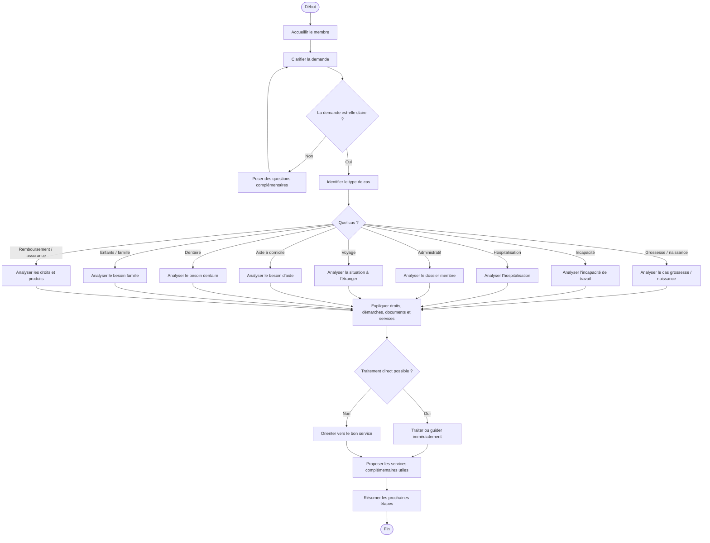
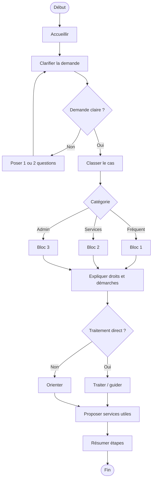
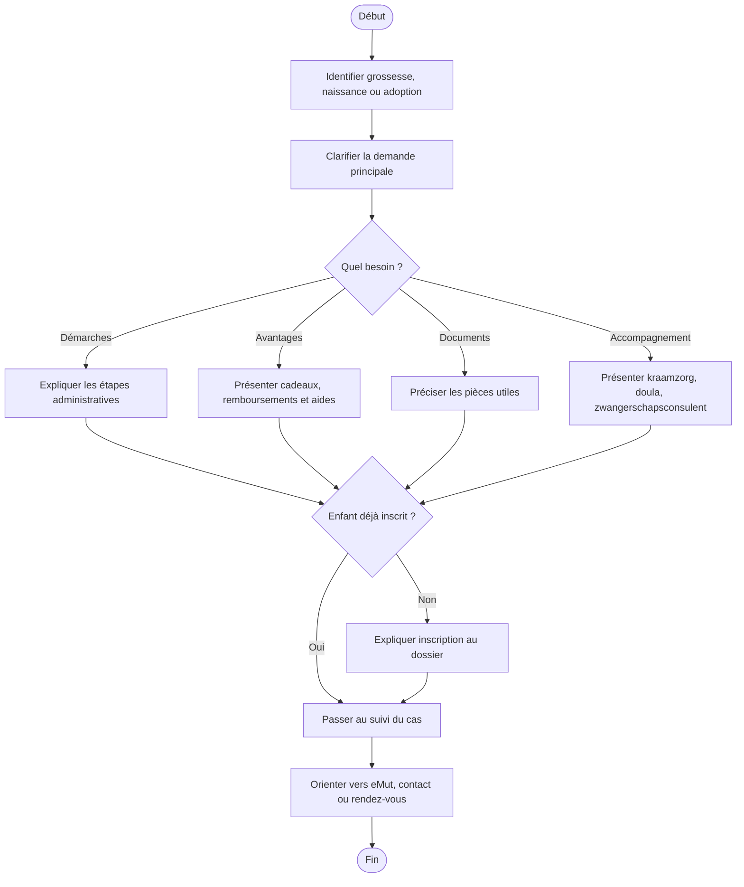
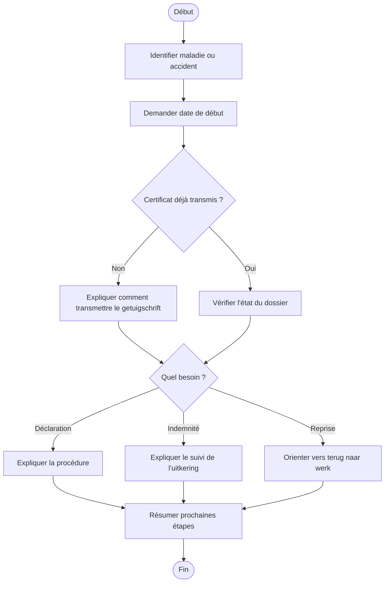
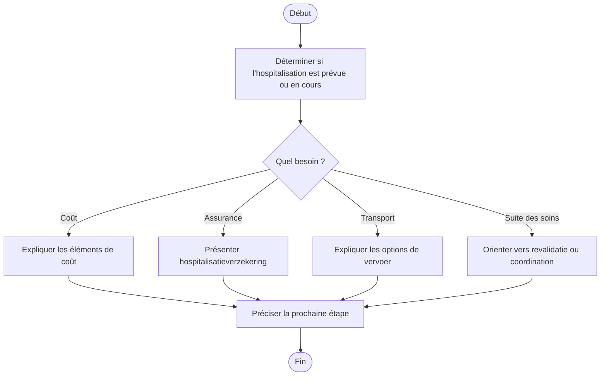
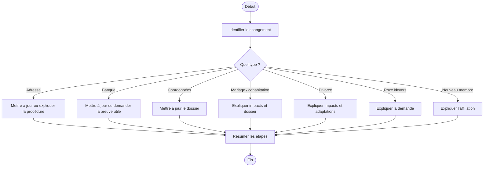
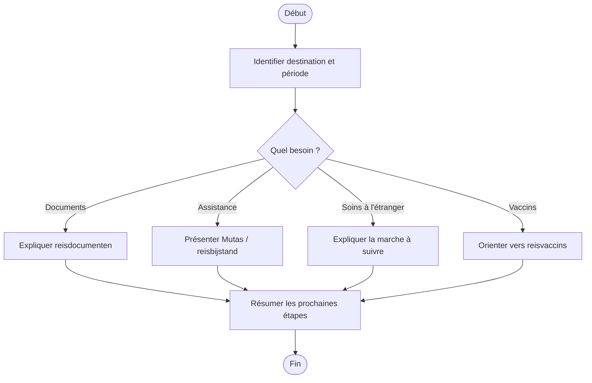
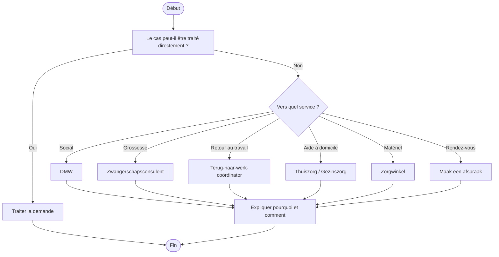

# Diagrammes - Parcours Ziekenfondsconsulent

> [!info] Note vidée
> Les diagrammes utiles sont maintenant intégrés directement dans les procédures. Cette note peut être ignorée pendant la révision.

> [!info] Compatibilité Obsidian
> Ces schémas utilisent **Mermaid**, lisible nativement dans Obsidian en mode lecture ou live preview.

## Diagramme - traitement complet d'une demande (version originale)

## Diagramme - traitement complet d'une demande (version refactorisée)

## Pourquoi la version refactorisée s'affiche mieux
- moins de branches en même temps
- libellés plus courts
- regroupement en 3 blocs au lieu d'ouvrir tous les cas d'un coup
- lecture plus naturelle dans Obsidian

## Diagramme - cas grossesse / naissance détaillé

## Diagramme - incapacité de travail détaillé

## Diagramme - hospitalisation détaillé

## Diagramme - changement administratif

## Diagramme - voyage et étranger

## Diagramme - orientation vers le bon service

