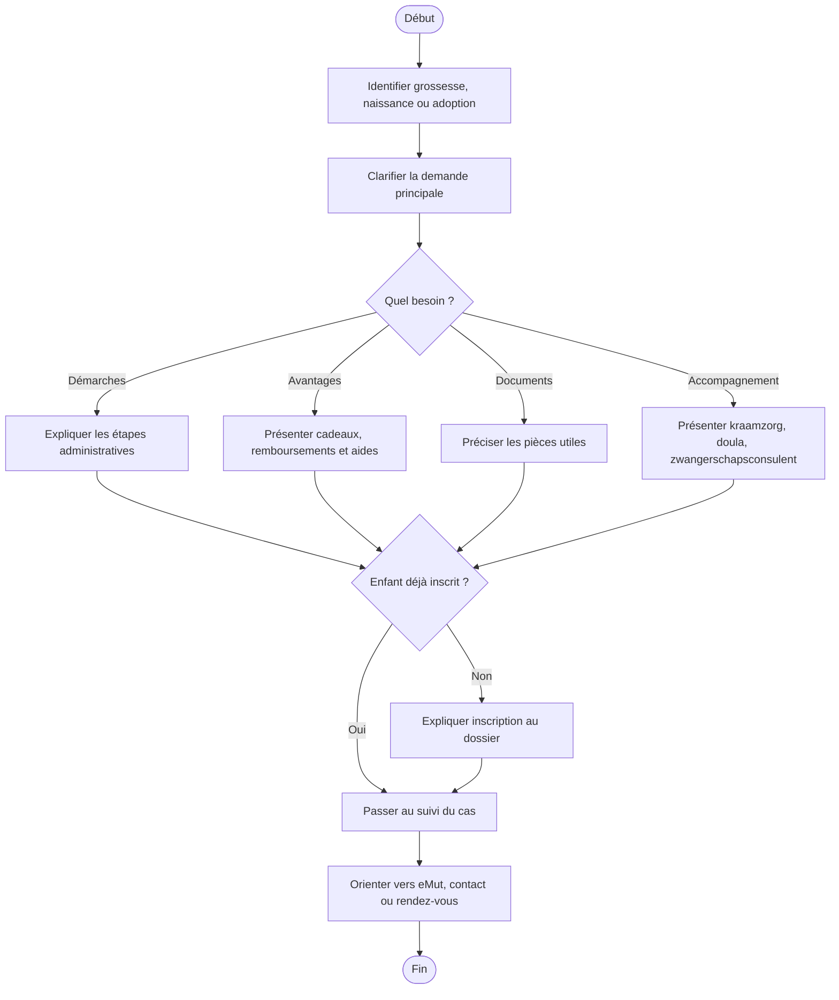

# Procédure - Accueil d'un membre qui attend un enfant

> [!tip] Trame d'entretien
> Utiliser cette procédure comme squelette oral pendant la simulation.
>
> 1. Clarifier la situation  
> 2. Vérifier les documents  
> 3. Expliquer les droits  
> 4. Donner les démarches  
> 5. Proposer les services utiles  
> 6. Conclure clairement

> [!danger] Délais et points critiques
> - <mark class='important'>Déclaration de naissance à la commune dans les 15 jours calendrier</mark>
> - <mark class='important'>Inscription de l'enfant chez Solidaris dès réception de l'attestation communale</mark>
> - <mark class='important'>Envoyer rapidement l'acte de naissance pour la moederschapsrust</mark>
> - <mark class='important'>Ouvrir un GMD dans les 6 mois après la naissance</mark>

## 1. Comprendre la situation

> [!info] Objectif
> Clarifier rapidement le contexte exact avant de répondre.

> [!info] Ce qu'il faut clarifier d'abord
> Avant de répondre, il faut savoir si on parle d'une <mark class='important'>grossesse en cours</mark>, d'une <mark class='important'>naissance déjà survenue</mark> ou d'une <mark class='important'>adoption</mark>.

> [!faq]- Questions utiles à poser
> - Le membre est-il déjà affilié chez Solidaris ou est-ce un futur membre ?
> - Le dossier est-il déjà actif et à jour ?
> - L'enfant sera-t-il inscrit chez ce parent comme personne à charge ?
> - La grossesse est-elle en cours ou l'enfant est-il déjà né ?
> - S'agit-il de la maman, du papa, du meeouder ou d'un parent adoptant ?
> - Quelle est la question la plus urgente aujourd'hui ?
> - Cherche-t-on surtout une information, un remboursement, un rendez-vous ou un accompagnement ?
> - Y a-t-il déjà une hospitalisation prévue ou passée ?
> - Souhaite-t-on aussi des infos sur les assurances ou avantages complémentaires ?

> [!faq]- Type de demande principale
> - remboursement → [[../07 - Sources/geboortevoordelen-en-terugbetalingen]]
> - démarches → [[../07 - Sources/wat-moet-je-regelen-na-de-geboorte]]
> - congé / indemnités → [[../07 - Sources/verlof-en-uitkeringen]]
> - hospitalisation → [[../07 - Sources/hospitalisatieverzekering]] et [[../07 - Sources/opname-in-het-ziekenhuis]]
> - inscription de l'enfant → [[../07 - Sources/wat-moet-je-regelen-na-de-geboorte]]
> - services d'accompagnement → [[../04 - Services et avantages/Services - Grossesse, naissance et accompagnement]]

## 2. Vérifier les besoins administratifs

> [!info] Vérifications administratives
> Vérifier le dossier, les documents et les éléments qui peuvent bloquer ou orienter la réponse.

> [!info] Vérifications administratives
> Toujours vérifier <mark class='underline'>l'identité</mark>, <mark class='underline'>la situation familiale</mark>, <mark class='underline'>les documents déjà reçus</mark> et <mark class='underline'>l'état du dossier</mark>.

> [!faq]- Questions administratives à poser
> - Nom et situation du membre dans le dossier
> - Lien exact avec l'enfant
> - Le registre du dossier est-il à jour ?
> - Le membre a-t-il accès à eMut ?
> - Des documents ont-ils déjà été reçus ou transmis ?

> [!faq]- Documents médicaux ou administratifs selon le cas
> - medisch geboorteattest de l'arts ou de la vroedvrouw
> - geboorteattest / extrait de naissance remis par la commune
> - carte d'identité des parents
> - trouwboekje ou erkenningsakte si applicable
> - attestation de la burgerlijke stand pour inscrire l'enfant
> - formulaire d'inscription comme personne à charge si nécessaire
> - copie de l'acte de naissance pour calcul de fin de moederschapsrust
> - facture d'hospitalisation si remboursement KliniPlan demandé
> - PDF utile déjà récupéré : [[../Attachments/Aanvraagformulier%20inschrijving%20kind%20als%20persoon%20ten%20laste%20304.pdf]]

## 3. Expliquer les droits et avantages

> [!Idea] Ce qu'il faut mettre en avant
> Le rôle du consulent n'est pas seulement de répondre à la question de départ. Il faut aussi <mark class='important'>vérifier tous les droits, services et avantages pertinents</mark> pour la famille.

> [!faq]- Remboursements et avantages liés à la grossesse et à la naissance
> - geboortegeschenk
> - cadeaux supplémentaires à 3 mois, 1 an et 3 ans
> - terugbetaling kraamzorg
> - terugbetaling doula / bevallingscoach
> - terugbetaling medische screening bij adoptie
> - terugbetaling remgeld pour enfants jusqu'à 6 ans dans les cas prévus par le site
> - terugbetaling afkolfapparaat + afkolfset gratuit
> - remboursement lié au médicament préventif RSV avec paiement du seul remgeld
> - loopfiets pour l'enfant
> - possible extra vergoeding via ViviPlan selon la page dédiée

> [!faq]- Accompagnements avant et après la naissance
> - infosessie Samen Zwanger
> - zwangerschapsconsulent
> - vroedvrouw
> - consultatiebureaus
> - inloopteam
> - advies opvoeding
> - chatbot Charlie
> - voir [[../04 - Services et avantages/Services - Grossesse, naissance et accompagnement]]

> [!faq]- Services à domicile ou d'accompagnement
> - kraamzorg
> - kinderopvang
> - thuisoppas zieke kinderen
> - poetshulp
> - services d'aide à domicile si la situation le justifie
> - voir [[../04 - Services et avantages/Services - Grossesse, naissance et accompagnement]]

> [!faq]- Avantages complémentaires pour l'enfant ou la famille
> - startbedrag et groeipakket
> - affiliation de l'enfant aux assurances complémentaires
> - KliniPlan / KliniPlanPlus si hospitalisation
> - DentaPlan
> - ViviPlan
> - GMD dans les 6 mois pour favoriser certains remboursements

## 4. Expliquer ce qu'il faut faire

> [!tip] Logique d'explication
> Expliquer les étapes, les documents, les délais et la manière de suivre le dossier.

> [!faq]- Démarches à faire maintenant
> - déclarer la naissance à la commune dans les 15 jours calendrier
> - demander ou finaliser la reconnaissance si nécessaire
> - inscrire l'enfant comme personne à charge chez Solidaris dès réception de l'attestation communale
> - transmettre la copie de l'acte de naissance à Solidaris pour la moederschapsrust si applicable
> - introduire la demande d'uitkering de geboorteverlof pour papa ou meeouder
> - choisir le geboortegeschenk Solidaris
> - vérifier que startbedrag et groeipakket sont bien en ordre
> - ajouter l'enfant aux assurances complémentaires si présentes
> - demander le remboursement de la facture d'hospitalisation si KliniPlan ou KliniPlanPlus
> - ouvrir un GMD chez le huisarts dans les 6 mois après la naissance

> [!faq]- Documents à transmettre
> - attestation de naissance / burgerlijke stand
> - acte de naissance ou copie utile au dossier
> - formulaire d'inscription de l'enfant comme personne à charge
> - certificat ou attestations nécessaires pour congés / indemnités selon le statut
> - facture d'hospitalisation pour demande de remboursement assurantiel

> [!faq]- Délais à surveiller
> - naissance à déclarer à la commune dans les 15 jours
> - inscription de l'enfant au ziekenfonds dès que possible après réception de l'attestation
> - copie de l'acte de naissance à envoyer rapidement pour la moederschapsrust
> - GMD à ouvrir dans les 6 mois après la naissance
> - démarches assurance et geboorteverlof à faire sans tarder

> [!faq]- Suivi du dossier
> - eMut pour consulter les données et certains documents
> - contactformulier pour questions générales
> - upload de documents via le site
> - afspraak en agence, téléphone ou vidéo si nécessaire

## 5. Proposer les services complémentaires

> [!tip] Posture commerciale utile
> Proposer uniquement les services, produits ou accompagnements qui ont du sens pour la situation du membre.

> [!faq]- Aides et accompagnements à proposer
> - kraamzorg
> - zwangerschapsconsulent
> - infosessie Samen Zwanger
> - vroedvrouw
> - consultatiebureaus
> - inloopteam
> - advies opvoeding

> [!faq]- Informations complémentaires à proposer
> - hospitalisatieverzekering KliniPlan / KliniPlanPlus
> - zwangerschapsverlof et moederschapsuitkering
> - geboorteverlof pour papa / meeouder
> - borstvoedingsverlof en -pauzes
> - protections au travail pendant la grossesse
> - werkverwijdering si risque professionnel

> [!faq]- Autres avantages membres pertinents pour le foyer
> - ViviPlan
> - DentaPlan
> - remgeld pour enfants
> - aides enfants et famille selon l'âge et la situation

## 6. Clôturer proprement

> [!important] Bonne clôture
> Le membre doit repartir en sachant quoi faire, quoi envoyer et à qui s'adresser.
- résumer les prochaines étapes
- vérifier que le membre sait quoi envoyer
- vérifier qu'il sait où envoyer les documents
- proposer un point de contact ou un suivi
- proposer un rendez-vous si la situation est plus complexe

## Diagramme

## Liens
- [[../05 - Situations de vie/Grossesse, naissance et arrivée d'un enfant]]
- [[../04 - Services et avantages/Services - Grossesse, naissance et accompagnement]]
- [[../04 - Services et avantages/Services et avantages de base]]
- [[../06 - Emails types/Emails types - Naissance et grossesse]]
- [[../07 - Sources/geboortevoordelen-en-terugbetalingen]]
- [[../07 - Sources/hulp-en-begeleiding-bij-zwangerschap-en-geboorte]]
- [[../07 - Sources/wat-moet-je-regelen-na-de-geboorte]]
- [[../07 - Sources/verlof-en-uitkeringen]]

## Liens
- [[../05 - Situations de vie/Grossesse, naissance et arrivée d'un enfant]]
- [[../04 - Services et avantages/Services et avantages de base]]
- [[../06 - Emails types/Emails types - Naissance et grossesse]]
