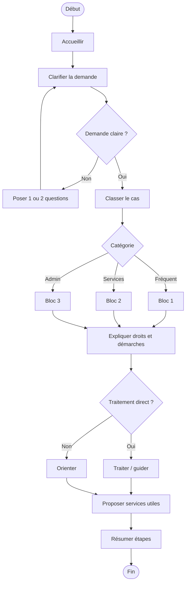

# Procédure - Accueil général d'un membre

> [!tip] Trame d'entretien
> Utiliser cette procédure comme squelette oral pendant une simulation ou en situation de service membre.

## 1. Comprendre la situation

> [!info] Objectif
> Clarifier rapidement le contexte exact avant de répondre.
- Quel est le contexte exact ?
  - demande simple, complexe, urgente ou confuse ?
- Le membre est-il déjà affilié ou s'agit-il d'un futur membre ?
- Quelle est la demande principale ?
  - information
  - remboursement
  - démarches
  - document
  - rendez-vous
  - orientation vers un autre service
- Questions utiles à poser
  - quelle est votre question la plus urgente aujourd'hui ?
  - avez-vous déjà transmis des documents ?
  - avez-vous besoin d'une information, d'un remboursement, d'un rendez-vous ou d'un accompagnement ?

## 2. Vérifier les besoins administratifs

> [!info] Vérifications administratives
> Vérifier le dossier, les documents et les éléments qui peuvent bloquer ou orienter la réponse.
- identité du membre
  - situation de dossier et statut du membre
- numéro de dossier / accès eMut si pertinent
- documents médicaux ou administratifs selon le cas
  - documents utiles à la demande en cours
- situation familiale, sociale ou administrative actualisée si pertinent

## 3. Expliquer les droits, avantages et services

> [!Idea] Réflexe important
> Ne pas répondre uniquement à la question immédiate. Vérifier aussi les droits, services et avantages liés au cas.
- droits ou remboursements liés au cas
  - dépend du type de demande
- services ou accompagnements disponibles
  - eMut
  - contactformulier
  - afspraak
  - services spécialisés si nécessaire
- avantages complémentaires ou produits pertinents
  - si la situation justifie une proposition utile

## 4. Expliquer ce qu'il faut faire

> [!tip] Logique d'explication
> Expliquer les étapes, les documents, les délais et la manière de suivre le dossier.
- quelles démarches faire maintenant
  - clarifier, compléter ou transmettre la demande
- quels documents transmettre
  - selon le cas
- quels délais surveiller
  - selon le cas
- comment suivre le dossier
  - eMut
  - contact
  - rendez-vous
  - upload de documents

## 5. Proposer les services complémentaires

> [!tip] Posture commerciale utile
> Proposer uniquement les services, produits ou accompagnements qui ont du sens pour la situation du membre.
- services directement utiles dans ce cas
  - eMut
  - prise de rendez-vous
  - service spécialisé
- informations complémentaires à proposer
  - étapes suivantes
- autres avantages membres pertinents
  - vérifier s'il existe un service complémentaire utile

## 6. Clôturer proprement

> [!important] Bonne clôture
> Le membre doit repartir en sachant quoi faire, quoi envoyer et à qui s'adresser.
- résumer les prochaines étapes
- vérifier que le membre sait quoi envoyer
- vérifier qu'il sait où envoyer les documents
- proposer un point de contact ou un suivi
- proposer un rendez-vous si la situation est plus complexe

## Diagramme

## Liens
- [[Procédure - Orientation vers le bon service]]
- [[../08 - Role Ziekenfondsconsulent/Ziekenfondsconsulent - Vue métier]]