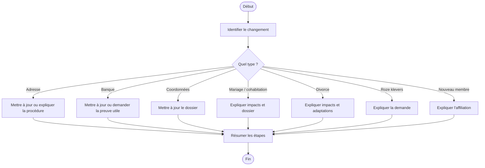

# Procédure - Changement administratif et dossier membre

> [!tip] Trame d'entretien
> Utiliser cette procédure comme squelette oral pendant une simulation ou en situation de service membre.
>
> 1. Identifier le changement  
> 2. Vérifier le dossier et les justificatifs  
> 3. Expliquer ce qui doit être mis à jour  
> 4. Donner les démarches  
> 5. Vérifier l'impact sur les droits et services  
> 6. Conclure clairement

> [!danger] Points de vigilance
> - <mark class='important'>Un dossier non mis à jour peut bloquer ou retarder certains droits</mark>
> - <mark class='important'>Toujours vérifier si le changement concerne aussi des personnes à charge</mark>
> - <mark class='important'>Faire la mise à jour dès que possible</mark>

## 1. Comprendre la situation

> [!info] Objectif
> Clarifier s'il s'agit d'un <mark class='important'>changement d'adresse</mark>, de <mark class='important'>coordonnées</mark>, de <mark class='important'>compte bancaire</mark>, de <mark class='important'>situation familiale</mark>, d'une <mark class='important'>demande de roze klevers</mark> ou d'une <mark class='important'>adhésion</mark>.

> [!faq]- Questions utiles à poser
> - Quel changement faut-il faire en priorité ?
> - S'agit-il d'une adresse, d'un compte bancaire, de coordonnées, d'une situation familiale, d'une demande de vignettes ou d'une affiliation ?
> - Le membre est-il déjà affilié ou s'agit-il d'un futur membre ?
> - Avez-vous déjà commencé la démarche en ligne ?
> - Avez-vous un document justificatif si nécessaire ?
> - Ce changement a-t-il un impact sur des personnes à charge ?

> [!faq]- Type de demande principale
> - mise à jour dossier
> - consultation du dossier
> - demande de vignettes
> - changement de situation familiale
> - adhésion

## 2. Vérifier les besoins administratifs

> [!info] Vérifications administratives
> Vérifier le <mark class='underline'>dossier</mark>, les <mark class='underline'>pièces justificatives</mark> et l'impact du changement sur le reste de la situation administrative.

> [!faq]- Vérifications à faire
> - identité du membre
> - numéro de dossier / accès eMut si pertinent
> - personnes à charge concernées ou non
> - changement de mariage, cohabitation, séparation, naissance ou autre événement de vie

> [!faq]- Documents médicaux ou administratifs selon le cas
> - preuve d'adresse ou autre justificatif selon le changement
> - informations bancaires si nécessaire
> - document lié à la situation familiale si utile
> - justificatifs adaptés à l'affiliation ou à l'inscription d'un proche si nécessaire

## 3. Expliquer les droits, avantages et services

> [!Idea] Ce qu'il faut mettre en avant
> Mettre à jour un dossier n'est pas qu'une formalité. Cela permet d'éviter des erreurs de remboursement, de contact ou d'inscription de personnes à charge.

> [!faq]- Droits et impacts liés au cas
> - dossier à jour pour éviter blocage de certains droits
> - bonne réception des courriers, remboursements et communications
> - adaptation correcte des données familiales et administratives

> [!faq]- Services ou accompagnements disponibles
> - eMut
> - aide administrative
> - contact
> - rendez-vous

> [!faq]- Vérifications utiles à faire en plus
> - vérifier si le changement modifie assurances, avantages ou inscription d'une personne à charge
> - vérifier si des roze klevers doivent être redemandés
> - vérifier si le changement influence l'accès à certains services

## 4. Expliquer ce qu'il faut faire

> [!faq]- Démarches à faire maintenant
> - mettre à jour le dossier
> - transmettre le justificatif si besoin
> - demander les roze klevers si utile
> - adapter les données familiales si nécessaire

> [!faq]- Documents à transmettre
> - justificatifs adaptés au changement
> - documents bancaires si nécessaire
> - documents familiaux si impact sur la composition du dossier

> [!faq]- Délais à surveiller
> - faire la mise à jour dès que possible pour éviter un dossier incomplet

> [!faq]- Suivi du dossier
> - eMut
> - contact
> - rendez-vous

## 5. Proposer les services complémentaires

> [!faq]- Services directement utiles dans ce cas
> - eMut
> - aide administrative
> - accompagnement pour les démarches numériques

> [!faq]- Informations complémentaires à proposer
> - outils numériques
> - rendez-vous
> - upload de documents

> [!faq]- Autres avantages membres pertinents
> - vérifier si le changement de situation ouvre de nouveaux droits ou avantages

## 6. Clôturer proprement
- résumer les prochaines étapes
- vérifier que le membre sait quoi envoyer
- vérifier qu'il sait où envoyer les documents
- proposer un point de contact ou un suivi
- proposer un rendez-vous si la situation est plus complexe

## Diagramme

## Liens
- [[../05 - Situations de vie/Vie quotidienne et changements administratifs - Synthèse entretien]]
- [[../07 - Sources/lid-worden]]
- [[../07 - Sources/mijn-dossier-in-e-mut-bekijken]]
- [[../07 - Sources/roze-klevers-aanvragen]]