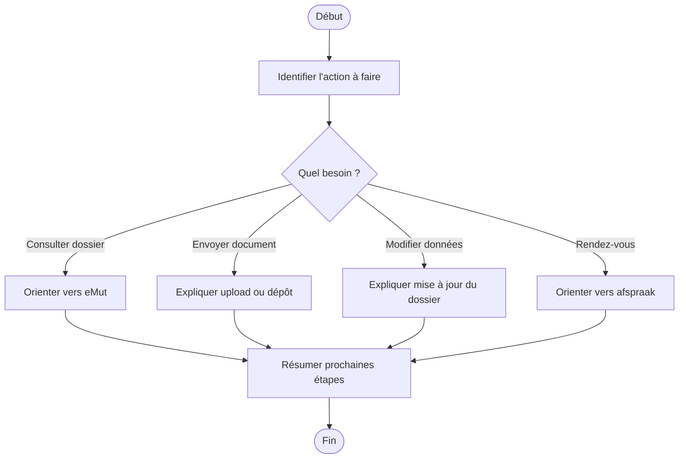

# Procédure - Dossier, contact et outils numériques

> [!tip] Trame d'entretien
> Utiliser cette procédure comme squelette oral pendant une simulation ou en situation de service membre.

## 1. Comprendre la situation

> [!info] Objectif
> Clarifier rapidement le contexte exact avant de répondre.
- Quel est le contexte exact ?
  - consultation du dossier, upload d'un document, modification de données, rendez-vous ou contact ?
- Le membre est-il déjà affilié ou s'agit-il d'un futur membre ?
- Quelle est la demande principale ?
  - consulter eMut
  - envoyer un document
  - modifier une donnée
  - prendre rendez-vous
  - trouver le bon point de contact
- Questions utiles à poser
  - avez-vous accès à eMut ?
  - souhaitez-vous faire la démarche seul ou avec aide ?
  - faut-il un afspraak téléphonique, vidéo ou en bureau ?

## 2. Vérifier les besoins administratifs

> [!info] Vérifications administratives
> Vérifier le dossier, les documents et les éléments qui peuvent bloquer ou orienter la réponse.
- identité du membre
- numéro de dossier / accès eMut si pertinent
- documents médicaux ou administratifs selon le cas
  - document à téléverser
  - justificatif selon la modification demandée
- situation familiale, sociale ou administrative actualisée si pertinent

## 3. Expliquer les droits, avantages et services

> [!Idea] Réflexe important
> Ne pas répondre uniquement à la question immédiate. Vérifier aussi les droits, services et avantages liés au cas.
- droits ou remboursements liés au cas
  - accès au dossier, aux données et aux services numériques
- services ou accompagnements disponibles
  - eMut
  - contactformulier
  - upload de documents
  - afspraak pour téléphone, vidéo ou bureau
- avantages complémentaires ou produits pertinents
  - services pratiques et accès simplifié au suivi du dossier

## 4. Expliquer ce qu'il faut faire

> [!tip] Logique d'explication
> Expliquer les étapes, les documents, les délais et la manière de suivre le dossier.
- quelles démarches faire maintenant
  - consulter le dossier
  - envoyer le document
  - modifier les données
  - prendre rendez-vous
- quels documents transmettre
  - selon le besoin
- quels délais surveiller
  - mettre à jour rapidement si un droit dépend de la donnée
- comment suivre le dossier
  - eMut
  - contact
  - rendez-vous
  - upload de documents

## 5. Proposer les services complémentaires

> [!tip] Posture commerciale utile
> Proposer uniquement les services, produits ou accompagnements qui ont du sens pour la situation du membre.
- services directement utiles dans ce cas
  - aide numérique
  - aide administrative
- informations complémentaires à proposer
  - quel canal est le plus adapté selon la demande
- autres avantages membres pertinents
  - utilisation des outils numériques pour gagner du temps

## 6. Clôturer proprement

> [!important] Bonne clôture
> Le membre doit repartir en sachant quoi faire, quoi envoyer et à qui s'adresser.
- résumer les prochaines étapes
- vérifier que le membre sait quoi envoyer
- vérifier qu'il sait où envoyer les documents
- proposer un point de contact ou un suivi
- proposer un rendez-vous si la situation est plus complexe

## Diagramme

## Liens
- [[../05 - Situations de vie/Dossier, contact et outils numériques - Synthèse entretien]]
- [[../07 - Sources/contact]]
- [[../07 - Sources/mijn-dossier-in-e-mut-bekijken]]
- [[../07 - Sources/een-afspraak-maken]]