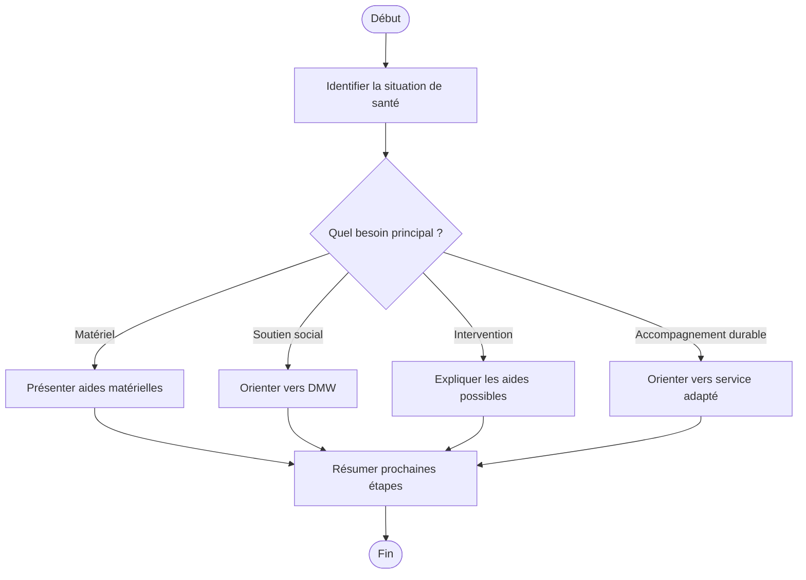

# Procédure - Handicap, maladie spécifique et aides matérielles

> [!tip] Trame d'entretien
> Utiliser cette procédure comme squelette oral pendant une simulation ou en situation de service membre.

## 1. Comprendre la situation

> [!info] Objectif
> Clarifier rapidement le contexte exact avant de répondre.
- Quel est le contexte exact ?
  - handicap, aandoening spécifique, besoin de matériel, besoin social ou maintien à domicile ?
- Le membre est-il déjà affilié ou s'agit-il d'un futur membre ?
- Quelle est la demande principale ?
  - matériel
  - intervention
  - soutien social
  - information
  - accompagnement durable
- Questions utiles à poser
  - quel est le besoin principal aujourd'hui ?
  - la personne a-t-elle besoin d'hulpmiddelen, zorgmateriaal ou d'un service social ?
  - faut-il un accompagnement pour vivre plus longtemps à domicile ?

## 2. Vérifier les besoins administratifs

> [!info] Vérifications administratives
> Vérifier le dossier, les documents et les éléments qui peuvent bloquer ou orienter la réponse.
- identité du membre
- numéro de dossier / accès eMut si pertinent
- documents médicaux ou administratifs selon le cas
  - attestations, prescriptions ou justificatifs selon le matériel ou le service demandé
- situation familiale, sociale ou administrative actualisée si pertinent
  - autonomie, aidants proches, retour à domicile, dépendance

## 3. Expliquer les droits, avantages et services

> [!Idea] Réflexe important
> Ne pas répondre uniquement à la question immédiate. Vérifier aussi les droits, services et avantages liés au cas.
- droits ou remboursements liés au cas
  - interventions pour personnes zorgbehoevenden selon conditions
- services ou accompagnements disponibles
  - hulpmiddelen en zorgmateriaal
  - zorgwinkel / advies sur adaptation du domicile
  - DMW
  - mantelszorg / soutien aidants proches
- avantages complémentaires ou produits pertinents
  - aides à domicile et services complémentaires utiles dans la durée

## 4. Expliquer ce qu'il faut faire

> [!tip] Logique d'explication
> Expliquer les étapes, les documents, les délais et la manière de suivre le dossier.
- quelles démarches faire maintenant
  - clarifier le besoin matériel ou social
  - transmettre les documents utiles
  - contacter le bon service spécialisé
- quels documents transmettre
  - prescriptions, attestations, justificatifs selon le cas
- quels délais surveiller
  - agir rapidement si le besoin impacte l'autonomie ou la sécurité
- comment suivre le dossier
  - eMut
  - contact
  - rendez-vous

## 5. Proposer les services complémentaires

> [!tip] Posture commerciale utile
> Proposer uniquement les services, produits ou accompagnements qui ont du sens pour la situation du membre.
- services directement utiles dans ce cas
  - DMW
  - zorgwinkel
  - aides à domicile
- informations complémentaires à proposer
  - adaptation du logement, maintien à domicile, soutien aux proches
- autres avantages membres pertinents
  - services longue durée, interventions complémentaires

## 6. Clôturer proprement

> [!important] Bonne clôture
> Le membre doit repartir en sachant quoi faire, quoi envoyer et à qui s'adresser.
- résumer les prochaines étapes
- vérifier que le membre sait quoi envoyer
- vérifier qu'il sait où envoyer les documents
- proposer un point de contact ou un suivi
- proposer un rendez-vous si la situation est plus complexe

## Diagramme

## Liens
- [[../05 - Situations de vie/Handicap, maladie spécifique et aides matérielles - Synthèse entretien]]
- [[../07 - Sources/specifieke-ziekte-of-aandoening]]
- [[../07 - Sources/hulpmiddelen-en-zorgmateriaal-bij-ziekte-ongeval-of-handicap]]
- [[../07 - Sources/advies-over-hulpmiddelen-en-langer-thuis-wonen]]
- [[../07 - Sources/extra-terugbetalingen-zorgbehoevenden]]
- [[../07 - Sources/mantelzorg]]