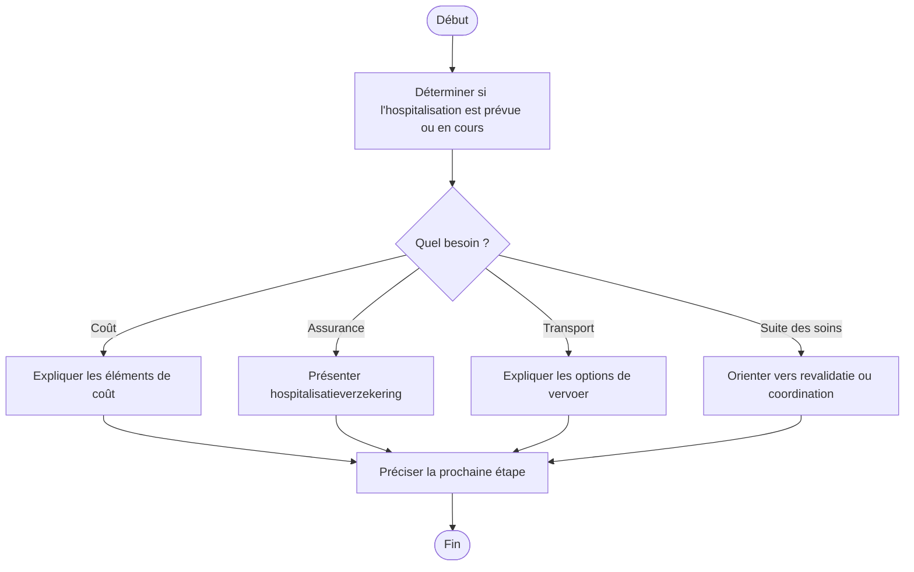

# Procédure - Hospitalisation

> [!tip] Trame d'entretien
> Utiliser cette procédure comme squelette oral pendant une simulation ou en situation de service membre.
>
> 1. Clarifier la situation  
> 2. Vérifier les documents  
> 3. Expliquer les coûts, droits et services  
> 4. Donner les démarches  
> 5. Proposer l'accompagnement utile  
> 6. Conclure clairement

> [!danger] Points de vigilance
> - <mark class='important'>Conserver la ziekenhuisfactuur pour toute demande de remboursement</mark>
> - <mark class='important'>Vérifier l'existence d'une hospitalisatieverzekering avant ou après l'admission</mark>
> - <mark class='important'>Anticiper le transport et le retour à domicile si la situation est fragile</mark>

## 1. Comprendre la situation

> [!info] Objectif
> Clarifier si on parle d'une <mark class='important'>hospitalisation prévue</mark>, <mark class='important'>en cours</mark> ou <mark class='important'>déjà terminée</mark>, puis identifier si le besoin concerne surtout le <mark class='important'>coût</mark>, l'<mark class='important'>assurance</mark>, le <mark class='important'>transport</mark> ou la <mark class='important'>suite des soins</mark>.

> [!faq]- Questions utiles à poser
> - L'hospitalisation est-elle prévue, en cours ou déjà passée ?
> - S'agit-il d'un séjour simple, d'une maternité, d'une intervention lourde, d'une revalidation ou d'un séjour à l'étranger ?
> - Le membre est-il déjà affilié ou s'agit-il d'un futur membre ?
> - La personne a-t-elle déjà reçu une facture ou un devis ?
> - Dispose-t-elle d'une hospitalisatieverzekering ?
> - S'agit-il d'un transport urgent ou non urgent ?
> - Une aide à domicile sera-t-elle nécessaire après l'hospitalisation ?

> [!faq]- Type de demande principale
> - coûts → [[../07 - Sources/kostprijs-ziekenhuis]]
> - assurance hospitalisation → [[../07 - Sources/hospitalisatieverzekering]]
> - transport → [[../07 - Sources/vervoer-opname]]
> - démarches avant / pendant / après → [[../07 - Sources/wat-te-doen-bij-opname]]
> - suite des soins / revalidation → [[../07 - Sources/revalidatie]]

## 2. Vérifier les besoins administratifs

> [!info] Vérifications administratives
> Vérifier le <mark class='underline'>dossier du membre</mark>, la <mark class='underline'>facture</mark>, l'<mark class='underline'>assurance</mark> et les besoins concrets du retour à domicile.

> [!faq]- Vérifications à faire
> - identité du membre
> - numéro de dossier / accès eMut si pertinent
> - retour à domicile, besoin de soutien, présence d'enfants ou d'aidants

> [!faq]- Documents médicaux ou administratifs selon le cas
> - facture d'hospitalisation
> - document d'assurance si pertinent
> - documents de transport ou d'admission si utiles
> - éléments utiles pour soins de suite ou revalidation

## 3. Expliquer les droits, avantages et services

> [!Idea] Ce qu'il faut mettre en avant
> Le membre doit comprendre <mark class='important'>ce que l'hospitalisation peut coûter</mark>, <mark class='important'>ce qui peut être remboursé</mark> et <mark class='important'>quels services peuvent faciliter l'après-hospitalisation</mark>.

> [!faq]- Droits et remboursements liés au cas
> - informations sur les coûts hospitaliers
> - possibilité de remboursement via hospitalisatieverzekering selon la situation
> - aide pour lire la ziekenhuisfactuur et estimer les coûts

> [!faq]- Services et accompagnements disponibles
> - dringend et niet-dringend ziekenvervoer
> - gezinszorg
> - nachthulp
> - poetshulp
> - thuisverpleging
> - woningaanpassing
> - revalidatie
> - kinesist
> - logopedie
> - oncologische revalidatie

> [!faq]- Produits ou avantages complémentaires pertinents
> - KliniPlan
> - KliniPlanPlus
> - aanvullende hospitalisatievergoeding

## 4. Expliquer ce qu'il faut faire

> [!faq]- Démarches à faire maintenant
> - vérifier la couverture assurantielle avant l'admission si possible
> - conserver la facture pour la demande de remboursement
> - organiser le transport adapté si nécessaire
> - préparer l'après-hospitalisation si un retour à domicile compliqué est prévu

> [!faq]- Documents à transmettre
> - facture d'hospitalisation
> - documents d'assurance si demandés
> - pièces liées au transport ou au suivi si utile

> [!faq]- Délais à surveiller
> - introduire la demande de remboursement sans attendre inutilement après réception de la facture

> [!faq]- Suivi du dossier
> - eMut
> - contact
> - rendez-vous

## 5. Proposer les services complémentaires

> [!faq]- Services directement utiles dans ce cas
> - assurance hospitalisation
> - transport
> - aide à domicile
> - revalidation

> [!faq]- Informations complémentaires à proposer
> - choix de chambre
> - coûts et suppléments
> - médecin conventionné
> - GMD

> [!faq]- Autres avantages membres pertinents
> - accompagnement durable si soins prolongés

## 6. Clôturer proprement
- résumer les prochaines étapes
- vérifier que le membre sait quoi envoyer
- vérifier qu'il sait où envoyer les documents
- proposer un point de contact ou un suivi
- proposer un rendez-vous si la situation est plus complexe

## Diagramme

## Liens
- [[../05 - Situations de vie/Hospitalisation - Synthèse entretien]]
- [[../07 - Sources/opname-in-het-ziekenhuis]]
- [[../07 - Sources/hospitalisatieverzekering]]
- [[../07 - Sources/vervoer-opname]]
- [[../07 - Sources/wat-te-doen-bij-opname]]
- [[../07 - Sources/kostprijs-ziekenhuis]]
- [[../07 - Sources/revalidatie]]
- [[../07 - Sources/ziekenhuisfactuur]]