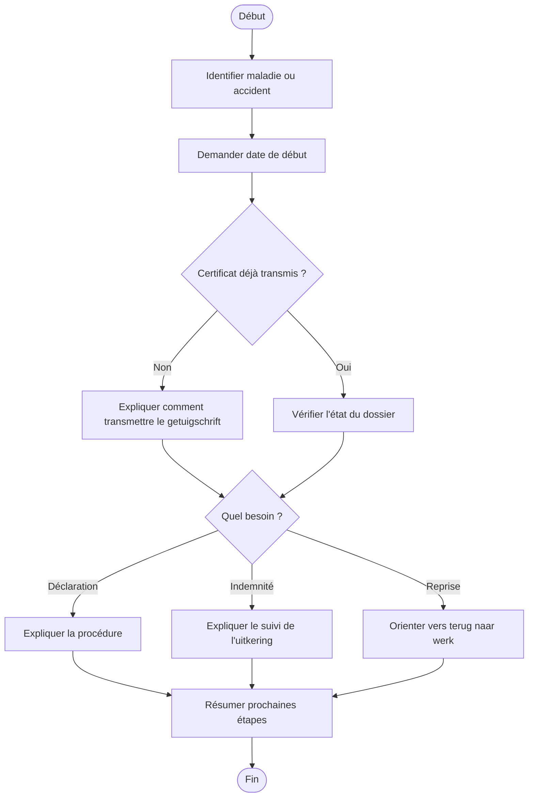

# Procédure - Incapacité de travail

> [!tip] Trame d'entretien
> Utiliser cette procédure comme squelette oral pendant une simulation ou en situation de service membre.
>
> 1. Clarifier la situation  
> 2. Vérifier les documents  
> 3. Expliquer les droits et le suivi  
> 4. Donner les démarches et délais  
> 5. Proposer l'accompagnement utile  
> 6. Conclure clairement

> [!danger] Délais et points critiques
> - <mark class='important'>Répondre à la vragenlijst re-integratie dans les 2 semaines</mark>
> - <mark class='important'>Demander une prolongation dans les 7 jours calendrier</mark>
> - <mark class='important'>Faire une nouvelle déclaration dans les 7 jours en cas de herval</mark>
> - <mark class='important'>Prévenir l'adviserend arts avant un départ à l'étranger</mark>

## 1. Comprendre la situation

> [!info] Objectif
> Clarifier rapidement s'il s'agit d'une <mark class='important'>première incapacité</mark>, d'une <mark class='important'>prolongation</mark>, d'une <mark class='important'>rechute</mark> ou d'un besoin d'information sur l'<mark class='important'>uitkering</mark>.

> [!faq]- Questions utiles à poser
> - Depuis quand l'incapacité a-t-elle commencé ?
> - S'agit-il d'une maladie ou d'un accident ?
> - Est-ce une première incapacité, une prolongation ou une rechute / herval ?
> - Le membre est-il déjà affilié ou s'agit-il d'un futur membre ?
> - Le document a-t-il déjà été transmis ?
> - Avez-vous reçu une convocation de l'adviserend arts ?
> - Avez-vous reçu la vragenlijst re-integratie ?
> - La demande concerne-t-elle surtout la procédure, l'indemnité, la reprise ou un départ à l'étranger ?

> [!faq]- Type de demande principale
> - déclaration → [[../07 - Sources/meld-je-arbeidsongeschiktheid]]
> - certificat → [[../07 - Sources/getuigschrift-van-arbeidsongeschiktheid-bezorgen]]
> - indemnité → [[../07 - Sources/bedrag-ziekte-uitkering]]
> - suivi du dossier → [[../07 - Sources/wat-te-doen-na-je-ziekte-aangifte]]
> - reprise / retour au travail → [[../07 - Sources/terug-naar-werk]]
> - départ à l'étranger pendant incapacité → [[../07 - Sources/arbeidsongeschikt-naar-het-buitenland]]

## 2. Vérifier les besoins administratifs

> [!info] Vérifications administratives
> Vérifier le <mark class='underline'>statut du membre</mark>, les <mark class='underline'>documents envoyés</mark> et les éléments qui peuvent modifier le dossier.

> [!faq]- Vérifications à faire
> - identité du membre et état du dossier
> - numéro de dossier / accès eMut si pertinent
> - changement de gezinssituatie
> - départ à l'étranger
> - pension imminente ou reprise partielle

> [!faq]- Documents médicaux ou administratifs selon le cas
> - getuigschrift van arbeidsongeschiktheid
> - formulaire 225 / inkomensverklaring si demandé
> - documents liés à une prolongation
> - documents liés à une rechute / herval
> - pièces liées à une reprise partielle ou complète

## 3. Expliquer les droits, avantages et services

> [!Idea] Ce qu'il faut mettre en avant
> Le membre doit comprendre <mark class='important'>ce qu'il doit faire</mark>, mais aussi <mark class='important'>ce à quoi il a droit</mark> et <mark class='important'>comment le dossier sera suivi</mark>.

> [!faq]- Droits et avantages liés au cas
> - droit à une ziekte-uitkering si conditions remplies
> - paiement toutes les 2 semaines pendant la 1re année
> - paiement mensuel en invalidité
> - possibilité d'inhaalpremie en mai si conditions remplies
> - accès à certains sociale voordelen

> [!faq]- Services et accompagnements disponibles
> - suivi administratif du dossier
> - terug-naar-werk-coördinator
> - informations sur deeltijds werken met uitkering
> - volledige werkhervatting
> - op mijn tempo terug aan het werk
> - herscholing

## 4. Expliquer ce qu'il faut faire

> [!faq]- Démarches à faire maintenant
> - déclarer l'incapacité si ce n'est pas encore fait
> - transmettre le getuigschrift au plus vite
> - répondre à la vragenlijst re-integratie dans les 2 semaines si elle est reçue
> - signaler tout changement de gezinssituatie
> - demander une prolongation dans les 7 jours calendrier si toujours malade après la date de fin
> - faire une nouvelle déclaration dans les 7 jours en cas de herval
> - prévenir l'adviserend arts bien à l'avance pour un départ à l'étranger

> [!faq]- Documents à transmettre
> - certificat d'incapacité
> - formulaire 225 si demandé
> - pièces complémentaires selon accident, reprise ou changement familial

> [!faq]- Délais à surveiller
> - retour de la vragenlijst re-integratie dans les 2 semaines
> - prolongation dans les 7 jours calendrier
> - nouvelle déclaration de rechute dans les 7 jours calendrier

> [!faq]- Suivi du dossier
> - eMut
> - contact
> - rendez-vous si besoin

## 5. Proposer les services complémentaires

> [!faq]- Services directement utiles dans ce cas
> - retour au travail
> - accompagnement administratif

> [!faq]- Informations complémentaires à proposer
> - calendrier de paiement
> - contrôle par l'adviserend arts
> - options de reprise partielle
> - possibilités de réorientation

> [!faq]- Autres avantages membres pertinents
> - sociale voordelen
> - accompagnement si impact durable sur la vie quotidienne

## 6. Clôturer proprement
- résumer les prochaines étapes
- vérifier que le membre sait quoi envoyer
- vérifier qu'il sait où envoyer les documents
- proposer un point de contact ou un suivi
- proposer un rendez-vous si la situation est plus complexe

## Diagramme

## Liens
- [[../05 - Situations de vie/Incapacité de travail - Synthèse entretien]]
- [[../07 - Sources/arbeidsongeschiktheid]]
- [[../07 - Sources/meld-je-arbeidsongeschiktheid]]
- [[../07 - Sources/getuigschrift-van-arbeidsongeschiktheid-bezorgen]]
- [[../07 - Sources/wat-te-doen-na-je-ziekte-aangifte]]
- [[../07 - Sources/bedrag-ziekte-uitkering]]
- [[../07 - Sources/terug-naar-werk]]