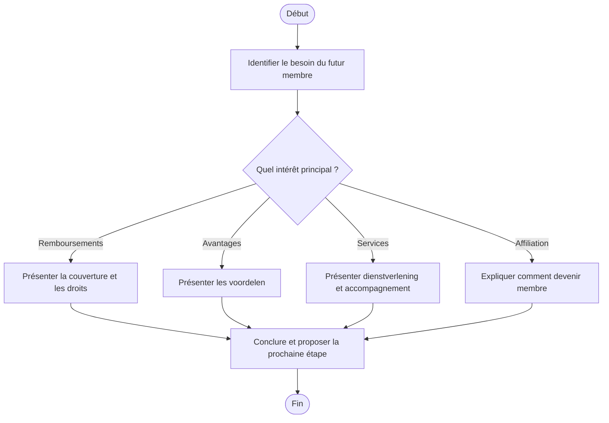

# Procédure - Nouveau membre et affiliation

> [!tip] Trame d'entretien
> Utiliser cette procédure comme squelette oral pendant une simulation ou en situation de service membre.
>
> 1. Comprendre le besoin du futur membre  
> 2. Vérifier les données nécessaires  
> 3. Expliquer la valeur de Solidaris  
> 4. Donner les démarches d'affiliation  
> 5. Proposer les services et produits utiles  
> 6. Conclure clairement

> [!danger] Points de vigilance
> - <mark class='important'>Un changement de mutualité ne prend effet qu'au 1er jour du trimestre suivant</mark>
> - <mark class='important'>La demande doit être introduite au plus tard le 4e jour du mois précédant ce trimestre</mark>
> - <mark class='important'>Toujours vérifier si des assurances complémentaires doivent être transférées ou adaptées</mark>

## 1. Comprendre la situation

> [!info] Objectif
> Clarifier si la personne veut simplement une <mark class='important'>information</mark>, comparer les <mark class='important'>avantages</mark> ou lancer directement une <mark class='important'>affiliation</mark>.

> [!faq]- Questions utiles à poser
> - Que recherchez-vous en priorité dans une mutualité ?
> - S'agit-il d'un premier ziekenfonds ou d'un changement ?
> - Le membre est-il déjà affilié ou s'agit-il d'un futur membre ?
> - Cherchez-vous surtout des remboursements, des avantages, des services ou un accompagnement administratif ?
> - Avez-vous des assurances complémentaires à transférer ?

> [!faq]- Type de demande principale
> - information sur l'affiliation
> - comparaison des avantages
> - services disponibles
> - démarrage de l'adhésion

## 2. Vérifier les besoins administratifs

> [!info] Vérifications administratives
> Vérifier les <mark class='underline'>données d'identité</mark>, la <mark class='underline'>situation familiale</mark> et les éléments nécessaires à l'affiliation ou au transfert de mutualité.

> [!faq]- Vérifications à faire
> - identité du membre
> - personnes à charge
> - statut de titularis
> - droit à verhoogde tegemoetkoming éventuelle

> [!faq]- Documents ou données à demander
> - eID ou Itsme pour inscription en ligne
> - rijksregisternummer
> - IBAN
> - informations sur ancien ziekenfonds si changement
> - documents signés si requis

## 3. Expliquer les droits, avantages et services

> [!Idea] Ce qu'il faut mettre en avant
> Il faut montrer que Solidaris ne propose pas seulement un remboursement de base, mais un ensemble de <mark class='important'>services</mark>, <mark class='important'>avantages</mark>, <mark class='important'>accompagnements</mark> et <mark class='important'>produits complémentaires</mark>.

> [!faq]- Droits et avantages liés au fait d'être membre
> - accès aux remboursements, services et avantages en tant que membre
> - personnes à charge assurées gratuitement avec le titulaire

> [!faq]- Services disponibles
> - inscription en ligne
> - affiliation sur rendez-vous
> - accompagnement pour transfert de mutualité
>
> - [[../07 - Sources/lid-worden]]
> - [[../07 - Sources/alle-voordelen-terugbetalingen-en-dienstverlening]]

> [!faq]- Produits ou avantages complémentaires à mentionner
> - verzekeringen
> - services et voordelen Solidaris
> - ledenbijdrage et tarification 2026 indiquées sur le site

## 4. Expliquer ce qu'il faut faire

> [!faq]- Démarches à faire maintenant
> - compléter l'inscription en ligne ou prendre rendez-vous
> - fournir les données nécessaires
> - laisser Solidaris gérer le changement de mutualité si applicable

> [!faq]- Documents à transmettre
> - identité
> - rijksregisternummer
> - IBAN
> - documents signés si requis

> [!faq]- Délais à surveiller
> - changement de mutualité au 1er jour du trimestre suivant
> - demande à introduire au plus tard le 4e jour du mois précédant le trimestre suivant

> [!faq]- Suivi du dossier
> - contact
> - rendez-vous
> - eMut après activation

## 5. Proposer les services complémentaires

> [!faq]- Services directement utiles dans ce cas
> - affiliation
> - explication des services
> - accompagnement pour transfert

> [!faq]- Informations complémentaires à proposer
> - ledenbijdrage
> - transfert d'assurances complémentaires

> [!faq]- Autres avantages membres pertinents
> - voordelen
> - terugbetalingen
> - diensten
> - verzekeringen

## 6. Clôturer proprement
- résumer les prochaines étapes
- vérifier que le membre sait quoi envoyer
- vérifier qu'il sait où envoyer les documents
- proposer un point de contact ou un suivi
- proposer un rendez-vous si la situation est plus complexe

## Diagramme

## Liens
- [[../05 - Situations de vie/Nouveau membre et affiliation - Synthèse entretien]]
- [[../07 - Sources/lid-worden]]
- [[../07 - Sources/alle-voordelen-terugbetalingen-en-dienstverlening]]
- [[../07 - Sources/verzekeringen]]