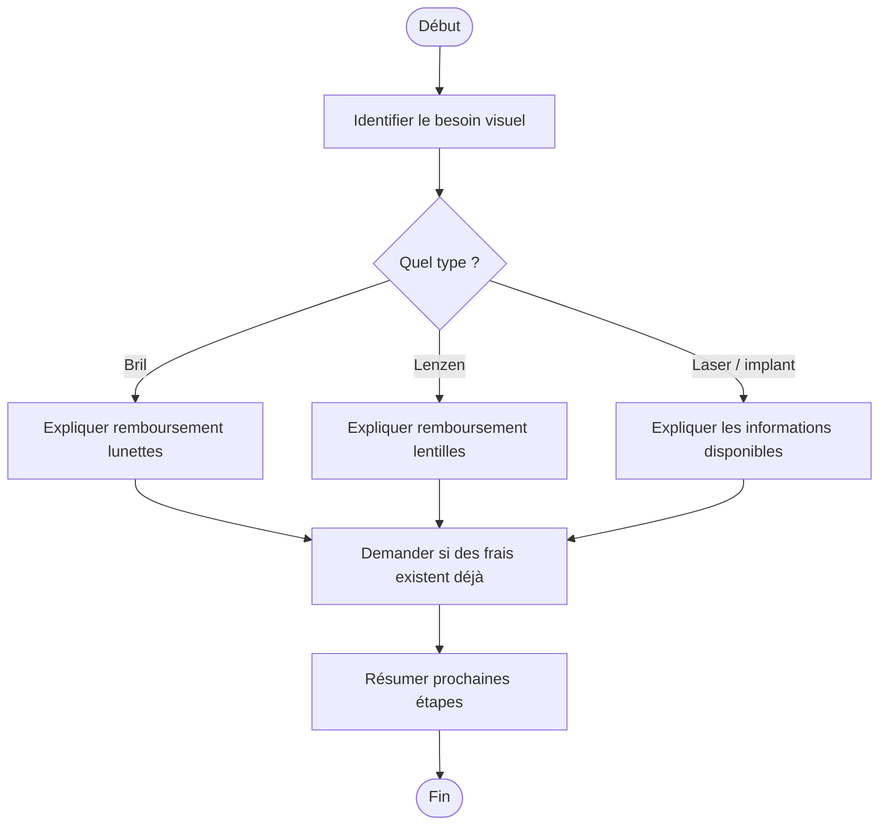

# Procédure - Optique

> [!tip] Trame d'entretien
> Utiliser cette procédure comme squelette oral pendant une simulation ou en situation de service membre.

## 1. Comprendre la situation

> [!info] Objectif
> Clarifier rapidement le contexte exact avant de répondre.
- Quel est le contexte exact ?
  - lunettes, lentilles, laser, implants ou autre besoin visuel ?
- Le membre est-il déjà affilié ou s'agit-il d'un futur membre ?
- Quelle est la demande principale ?
  - information
  - remboursement
  - facture déjà payée
  - orientation vers un opticien
- Questions utiles à poser
  - les frais ont-ils déjà été engagés ?
  - l'achat a-t-il été fait chez un opticien participant ?
  - s'agit-il de lunettes, lenzen, laser ou lensimplantaten ?

## 2. Vérifier les besoins administratifs

> [!info] Vérifications administratives
> Vérifier le dossier, les documents et les éléments qui peuvent bloquer ou orienter la réponse.
- identité du membre
- numéro de dossier / accès eMut si pertinent
- documents médicaux ou administratifs selon le cas
  - facture ou betalingsbewijs
  - voorschrift oogarts si remboursement légal demandé
  - getuigschrift van aflevering de l'opticien si nécessaire
- situation familiale, sociale ou administrative actualisée si pertinent
  - âge, dioptrie et conditions influençant le remboursement légal

## 3. Expliquer les droits, avantages et services

> [!Idea] Réflexe important
> Ne pas répondre uniquement à la question immédiate. Vérifier aussi les droits, services et avantages liés au cas.
- droits ou remboursements liés au cas
  - 25 euros par année calendrier pour lunettes ou lenzen op sterkte
  - réduction de 50 % jusqu'à 50 euros chez un opticien participant
  - remboursement légal dans certains cas selon âge et dioptrie
  - remboursement partiel du montuur pour les moins de 18 ans
- services ou accompagnements disponibles
  - réseau d'opticiens participants
- avantages complémentaires ou produits pertinents
  - possibilité de combiner réduction et remboursement dans les cas prévus

## 4. Expliquer ce qu'il faut faire

> [!tip] Logique d'explication
> Expliquer les étapes, les documents, les délais et la manière de suivre le dossier.
- quelles démarches faire maintenant
  - vérifier si l'achat a été fait chez un opticien participant
  - si non participant, envoyer facture ou preuve de paiement
  - pour remboursement légal, passer par l'oogarts et l'opticien avec les attestations requises
- quels documents transmettre
  - facture / betalingsbewijs
  - voorschrift
  - getuigschrift van aflevering
  - confirmation mail si achat en ligne
- quels délais surveiller
  - agir dans l'année calendrier et après achat dans un délai raisonnable
- comment suivre le dossier
  - eMut si pertinent
  - contact
  - rendez-vous ou dépôt en bureau / brievenbus

## 5. Proposer les services complémentaires

> [!tip] Posture commerciale utile
> Proposer uniquement les services, produits ou accompagnements qui ont du sens pour la situation du membre.
- services directement utiles dans ce cas
  - orientation vers opticien participant
- informations complémentaires à proposer
  - remboursement des lenzen
  - ogen laseren / lensimplantaten
  - oogpleisters
- autres avantages membres pertinents
  - autres remboursements santé liés à la vue

## 6. Clôturer proprement

> [!important] Bonne clôture
> Le membre doit repartir en sachant quoi faire, quoi envoyer et à qui s'adresser.
- résumer les prochaines étapes
- vérifier que le membre sait quoi envoyer
- vérifier qu'il sait où envoyer les documents
- proposer un point de contact ou un suivi
- proposer un rendez-vous si la situation est plus complexe

## Diagramme

## Liens
- [[../05 - Situations de vie/Optique - Synthèse entretien]]
- [[../07 - Sources/terugbetaling-bril]]
- [[../07 - Sources/terugbetaling-lenzen]]
- [[../07 - Sources/terugbetaling-ogen-laseren-of-lensimplantaten]]
- [[../07 - Sources/terugbetaling-oogpleisters]]
- [[../07 - Sources/optiekers]]