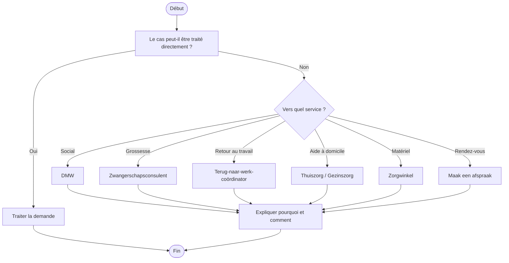

# Procédure - Orientation vers le bon service

> [!tip] Trame d'entretien
> Utiliser cette procédure comme squelette oral pendant une simulation ou en situation de service membre.

## 1. Comprendre la situation

> [!info] Objectif
> Clarifier rapidement le contexte exact avant de répondre.
- Quel est le contexte exact ?
  - la demande dépasse-t-elle le traitement direct du front office ?
- Le membre est-il déjà affilié ou s'agit-il d'un futur membre ?
- Quelle est la demande principale ?
  - service social
  - grossesse / naissance
  - retour au travail
  - aide à domicile
  - matériel
  - rendez-vous spécialisé
- Questions utiles à poser
  - quel est le besoin concret que vous n'arrivez pas encore à résoudre ?
  - avez-vous déjà été en contact avec un autre service ?
  - avez-vous besoin d'un suivi plus approfondi ?

## 2. Vérifier les besoins administratifs

> [!info] Vérifications administratives
> Vérifier le dossier, les documents et les éléments qui peuvent bloquer ou orienter la réponse.
- identité du membre
- numéro de dossier / accès eMut si pertinent
- documents médicaux ou administratifs selon le cas
  - uniquement ceux nécessaires pour orienter correctement
- situation familiale, sociale ou administrative actualisée si pertinent

## 3. Expliquer les droits, avantages et services

> [!Idea] Réflexe important
> Ne pas répondre uniquement à la question immédiate. Vérifier aussi les droits, services et avantages liés au cas.
- droits ou remboursements liés au cas
  - s'assurer que le membre ne perd pas un droit faute d'orientation correcte
- services ou accompagnements disponibles
  - DMW
  - zwangerschapsconsulent
  - terug-naar-werk-coördinator
  - thuiszorg / gezinszorg
  - zorgwinkel
  - afspraak
- avantages complémentaires ou produits pertinents
  - selon le service vers lequel la personne est orientée

## 4. Expliquer ce qu'il faut faire

> [!tip] Logique d'explication
> Expliquer les étapes, les documents, les délais et la manière de suivre le dossier.
- quelles démarches faire maintenant
  - prendre le bon rendez-vous
  - utiliser le bon canal
  - transmettre les documents utiles au bon service
- quels documents transmettre
  - uniquement ceux utiles à la prise en charge du service ciblé
- quels délais surveiller
  - agir rapidement si l'orientation conditionne un droit ou un suivi urgent
- comment suivre le dossier
  - contact
  - rendez-vous
  - eMut si pertinent

## 5. Proposer les services complémentaires

> [!tip] Posture commerciale utile
> Proposer uniquement les services, produits ou accompagnements qui ont du sens pour la situation du membre.
- services directement utiles dans ce cas
  - service spécialisé adapté
- informations complémentaires à proposer
  - pourquoi cette orientation aide mieux le membre
- autres avantages membres pertinents
  - services voisins utiles selon la situation

## 6. Clôturer proprement

> [!important] Bonne clôture
> Le membre doit repartir en sachant quoi faire, quoi envoyer et à qui s'adresser.
- résumer les prochaines étapes
- vérifier que le membre sait quoi envoyer
- vérifier qu'il sait où envoyer les documents
- proposer un point de contact ou un suivi
- proposer un rendez-vous si la situation est plus complexe

## Diagramme

## Liens
- [[../01 - Prioritaire/Office cible - Renaix et Oost-Vlaanderen]]
- [[../07 - Sources/contact]]
- [[../07 - Sources/maak-een-afspraak]]