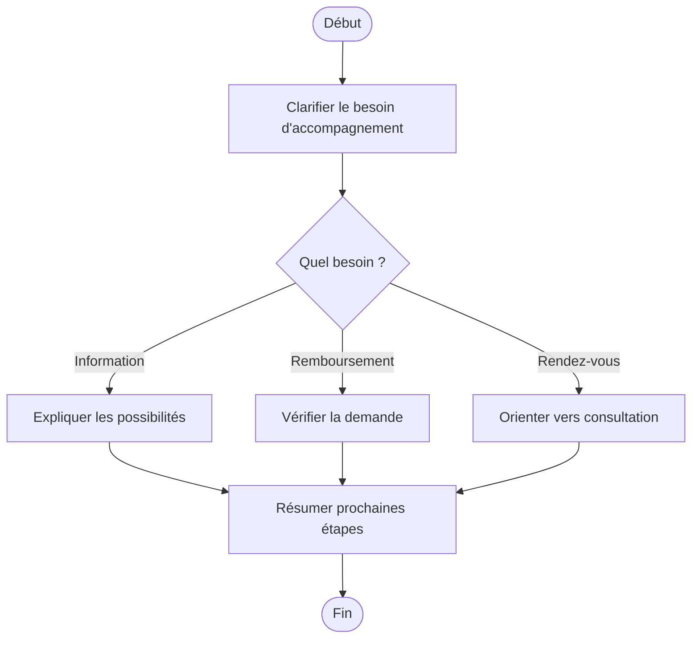

# Procédure - Psychologie et bien-être

> [!tip] Trame d'entretien
> Utiliser cette procédure comme squelette oral pendant une simulation ou en situation de service membre.

## 1. Comprendre la situation

> [!info] Objectif
> Clarifier rapidement le contexte exact avant de répondre.
- Quel est le contexte exact ?
  - recherche d'un psychologue, d'un conseil santé, d'une consultation ou d'un remboursement ?
- Le membre est-il déjà affilié ou s'agit-il d'un futur membre ?
- Quelle est la demande principale ?
  - information
  - orientation
  - remboursement
  - prise de rendez-vous
- Questions utiles à poser
  - quel type d'accompagnement recherchez-vous ?
  - avez-vous besoin d'un psycholoog, diëtist, tabacoloog, audioloog ou podoloog ?
  - souhaitez-vous surtout une orientation ou un remboursement ?

## 2. Vérifier les besoins administratifs

> [!info] Vérifications administratives
> Vérifier le dossier, les documents et les éléments qui peuvent bloquer ou orienter la réponse.
- identité du membre
- numéro de dossier / accès eMut si pertinent
- documents médicaux ou administratifs selon le cas
  - facture ou justificatif si remboursement demandé
- situation familiale, sociale ou administrative actualisée si pertinent

## 3. Expliquer les droits, avantages et services

> [!Idea] Réflexe important
> Ne pas répondre uniquement à la question immédiate. Vérifier aussi les droits, services et avantages liés au cas.
- droits ou remboursements liés au cas
  - selon la consultation ou l'accompagnement choisi
- services ou accompagnements disponibles
  - psychologische begeleiding
  - gezondheidsconsultaties
  - consultations avec psychologue, diëtist, personal trainer, pedicure, podoloog, tabacoloog, audioloog, coach Bewegen Op Verwijzing
- avantages complémentaires ou produits pertinents
  - services de bien-être et prévention utiles selon le profil

## 4. Expliquer ce qu'il faut faire

> [!tip] Logique d'explication
> Expliquer les étapes, les documents, les délais et la manière de suivre le dossier.
- quelles démarches faire maintenant
  - clarifier le besoin
  - prendre rendez-vous si nécessaire
  - transmettre la demande de remboursement si applicable
- quels documents transmettre
  - facture ou pièce justificative si besoin
- quels délais surveiller
  - agir rapidement si accompagnement important pour le membre
- comment suivre le dossier
  - contact
  - rendez-vous
  - eMut si pertinent

## 5. Proposer les services complémentaires

> [!tip] Posture commerciale utile
> Proposer uniquement les services, produits ou accompagnements qui ont du sens pour la situation du membre.
- services directement utiles dans ce cas
  - consultation adaptée
  - orientation santé
- informations complémentaires à proposer
  - autres consultations ou accompagnements complémentaires
- autres avantages membres pertinents
  - prévention, santé, bien-être

## 6. Clôturer proprement

> [!important] Bonne clôture
> Le membre doit repartir en sachant quoi faire, quoi envoyer et à qui s'adresser.
- résumer les prochaines étapes
- vérifier que le membre sait quoi envoyer
- vérifier qu'il sait où envoyer les documents
- proposer un point de contact ou un suivi
- proposer un rendez-vous si la situation est plus complexe

## Diagramme

## Liens
- [[../05 - Situations de vie/Psychologie et bien-être - Synthèse entretien]]
- [[../07 - Sources/psychologische-begeleiding]]
- [[../07 - Sources/gezondheidsconsultaties-maak-een-afspraak]]
- [[../07 - Sources/gezond-leven]]