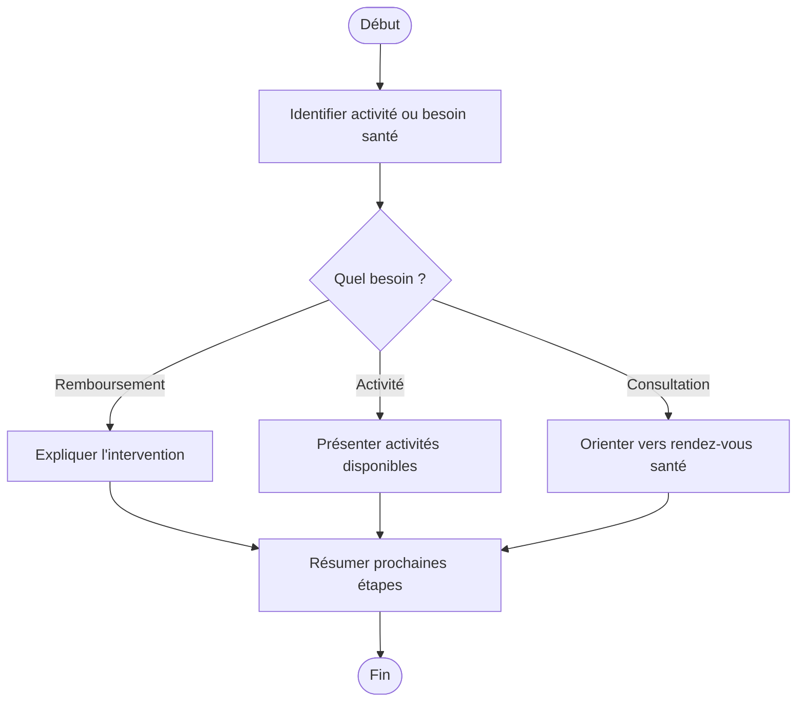

# Procédure - Sport, prévention et santé

> [!tip] Trame d'entretien
> Utiliser cette procédure comme squelette oral pendant une simulation ou en situation de service membre.

## 1. Comprendre la situation

> [!info] Objectif
> Clarifier rapidement le contexte exact avant de répondre.
- Quel est le contexte exact ?
  - activité sportive, mouvement, remboursement jeunesse, conseil santé ou prévention ?
- Le membre est-il déjà affilié ou s'agit-il d'un futur membre ?
- Quelle est la demande principale ?
  - information
  - remboursement
  - activité
  - consultation santé
- Questions utiles à poser
  - s'agit-il d'un sport, d'une jeugdbeweging, d'une activité santé ou d'une consultation ?
  - avez-vous déjà payé l'activité ?
  - cherchez-vous aussi un conseil santé ou beweegadvies ?

## 2. Vérifier les besoins administratifs

> [!info] Vérifications administratives
> Vérifier le dossier, les documents et les éléments qui peuvent bloquer ou orienter la réponse.
- identité du membre
- numéro de dossier / accès eMut si pertinent
- documents médicaux ou administratifs selon le cas
  - preuve de paiement ou inscription à l'activité si nécessaire
- situation familiale, sociale ou administrative actualisée si pertinent

## 3. Expliquer les droits, avantages et services

> [!Idea] Réflexe important
> Ne pas répondre uniquement à la question immédiate. Vérifier aussi les droits, services et avantages liés au cas.
- droits ou remboursements liés au cas
  - terugbetaling sport en jeugdbeweging selon les règles applicables
- services ou accompagnements disponibles
  - sporten en bewegen
  - beweegadvies
  - gezondheidsconsultaties
  - sport- en beweegactiviteiten
- avantages complémentaires ou produits pertinents
  - activités santé et prévention utiles pour le membre ou la famille

## 4. Expliquer ce qu'il faut faire

> [!tip] Logique d'explication
> Expliquer les étapes, les documents, les délais et la manière de suivre le dossier.
- quelles démarches faire maintenant
  - identifier l'activité concernée
  - introduire la demande de remboursement si applicable
  - prendre rendez-vous pour une consultation santé si besoin
- quels documents transmettre
  - justificatif de paiement ou autre pièce utile
- quels délais surveiller
  - introduire la demande dans un délai approprié après paiement
- comment suivre le dossier
  - eMut
  - contact
  - rendez-vous

## 5. Proposer les services complémentaires

> [!tip] Posture commerciale utile
> Proposer uniquement les services, produits ou accompagnements qui ont du sens pour la situation du membre.
- services directement utiles dans ce cas
  - activiteiten
  - consultaties
  - beweegadvies
- informations complémentaires à proposer
  - autres activités santé ou prévention
- autres avantages membres pertinents
  - aides sport, jeunesse, famille

## 6. Clôturer proprement

> [!important] Bonne clôture
> Le membre doit repartir en sachant quoi faire, quoi envoyer et à qui s'adresser.
- résumer les prochaines étapes
- vérifier que le membre sait quoi envoyer
- vérifier qu'il sait où envoyer les documents
- proposer un point de contact ou un suivi
- proposer un rendez-vous si la situation est plus complexe

## Diagramme

## Liens
- [[../05 - Situations de vie/Sport, prévention et santé - Synthèse entretien]]
- [[../07 - Sources/sporten-en-bewegen]]
- [[../07 - Sources/terugbetaling-sport-en-jeugdbeweging]]
- [[../07 - Sources/gezondheidsconsultaties-maak-een-afspraak]]
- [[../07 - Sources/sport-en-beweegactiviteiten]]