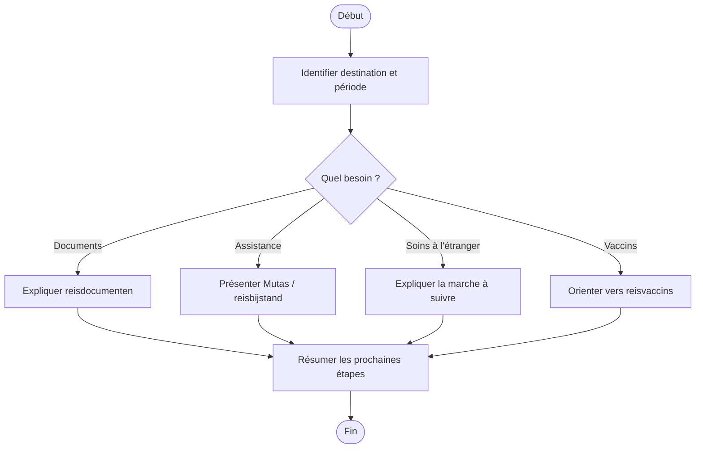

# Procédure - Voyage et étranger

> [!tip] Trame d'entretien
> Utiliser cette procédure comme squelette oral pendant une simulation ou en situation de service membre.
>
> 1. Clarifier le voyage ou le problème à l'étranger  
> 2. Vérifier les documents nécessaires  
> 3. Expliquer les droits et l'assistance  
> 4. Donner les démarches et délais  
> 5. Proposer les services utiles  
> 6. Conclure clairement

> [!danger] Délais et points critiques
> - <mark class='important'>Commander certains documents spéciaux idéalement 3 semaines avant le départ</mark>
> - <mark class='important'>Commander la version papier de l'EZVK au moins 2 semaines avant le départ si nécessaire</mark>
> - <mark class='important'>Prévenir l'adviserend arts si la personne est en incapacité de travail</mark>

## 1. Comprendre la situation

> [!info] Objectif
> Clarifier si la demande concerne un <mark class='important'>départ</mark>, un <mark class='important'>séjour en cours</mark>, un <mark class='important'>retour</mark> ou un <mark class='important'>problème de soins à l'étranger</mark>.

> [!faq]- Questions utiles à poser
> - Quelle est la destination ?
> - Pour quelle période ?
> - Voyage en Europe, dans un pays avec document spécial ou ailleurs ?
> - Le membre est-il déjà affilié ou s'agit-il d'un futur membre ?
> - La personne est-elle en incapacité de travail ?
> - Cherche-t-elle surtout un document, une assistance, un remboursement ou une information sur les vaccins ?

> [!faq]- Type de demande principale
> - documents → [[../07 - Sources/reisdocumenten-aanvragen]]
> - assistance → [[../07 - Sources/reisbijstand-mutas]]
> - soins à l'étranger
> - vaccins → [[../07 - Sources/terugbetaling-vaccins]]
> - remboursement

## 2. Vérifier les besoins administratifs

> [!info] Vérifications administratives
> Vérifier les <mark class='underline'>documents de voyage</mark>, la <mark class='underline'>destination</mark> et l'éventuelle <mark class='underline'>situation d'incapacité de travail</mark>.

> [!faq]- Vérifications à faire
> - identité du membre
> - numéro de dossier / accès eMut si pertinent
> - personnes à charge voyageant aussi
> - incapacité de travail en cours ou non

> [!faq]- Documents médicaux ou administratifs selon le cas
> - EZVK ou documents spéciaux de voyage
> - attestations utiles pour visa si nécessaire
> - justificatifs si des soins ont déjà été payés sur place
> - rijksregisternummer
> - destination et dates de voyage

## 3. Expliquer les droits, avantages et services

> [!Idea] Ce qu'il faut mettre en avant
> Le membre doit comprendre <mark class='important'>quel document il lui faut</mark>, <mark class='important'>comment demander de l'aide à l'étranger</mark> et <mark class='important'>ce qui peut être remboursé</mark>.

> [!faq]- Droits et remboursements liés au cas
> - EZVK pour UE et pays assimilés
> - documents spéciaux papier pour certains pays
> - possibilité de remboursement local ou après retour selon la situation
> - remboursement vaccins jusqu'à 25 euros selon la page dédiée

> [!faq]- Services disponibles
> - Mutas 24/7, numéro +32 2 272 08 80
> - accès numérique à l'EZVK dans eMut
> - aide sur SOLVIT si souci avec une institution dans l'UE

> [!faq]- Avantages ou services complémentaires à mentionner
> - reisbijstand Mutas
> - aide à la compréhension des démarches avant départ

## 4. Expliquer ce qu'il faut faire

> [!faq]- Démarches à faire maintenant
> - commander les documents de voyage
> - vérifier s'il faut une version papier ou non
> - commander idéalement 3 semaines avant le départ pour documents spéciaux ou attestations
> - commander la version papier de l'EZVK au moins 2 semaines avant le départ si nécessaire
> - prévenir l'adviserend arts bien à l'avance si la personne est en incapacité de travail

> [!faq]- Documents à transmettre
> - rijksregisternummer
> - destination et dates de voyage
> - pièces de soins si remboursement à demander après retour

> [!faq]- Délais à surveiller
> - 3 semaines avant le départ pour documents spéciaux ou attestations visa
> - 2 semaines avant le départ pour version papier EZVK

> [!faq]- Suivi du dossier
> - eMut
> - contact
> - rendez-vous

## 5. Proposer les services complémentaires

> [!faq]- Services directement utiles dans ce cas
> - EZVK
> - Mutas
> - vaccins

> [!faq]- Informations complémentaires à proposer
> - que faire en cas de maladie ou accident sur place
> - éviter les médecins privés / hôpitaux privés non couverts comme indiqué sur la page

> [!faq]- Autres avantages membres pertinents
> - aide au remboursement des vaccins

## 6. Clôturer proprement
- résumer les prochaines étapes
- vérifier que le membre sait quoi envoyer
- vérifier qu'il sait où envoyer les documents
- proposer un point de contact ou un suivi
- proposer un rendez-vous si la situation est plus complexe

## Diagramme

## Liens
- [[../05 - Situations de vie/Voyage et étranger - Synthèse entretien]]
- [[../07 - Sources/reisdocumenten-aanvragen]]
- [[../07 - Sources/reisbijstand-mutas]]
- [[../07 - Sources/terugbetaling-vaccins]]
- [[../07 - Sources/arbeidsongeschikt-naar-het-buitenland]]