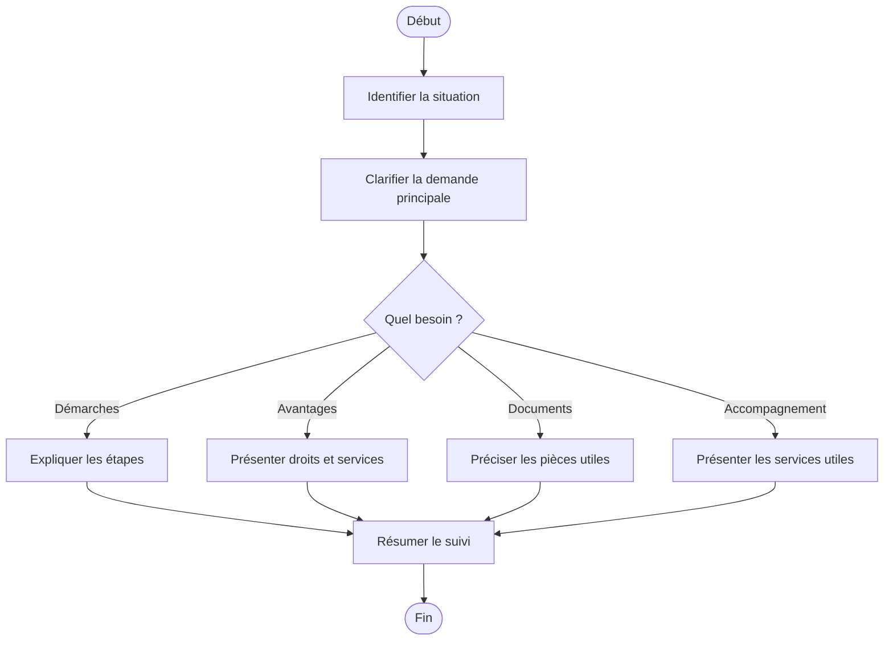

# Procédure - [Nom du cas]

> [!tip] Trame d'entretien
> Utiliser cette procédure comme squelette oral pendant une simulation ou en situation de service membre.

## 1. Comprendre la situation
- Quel est le contexte exact ?
  - questions utiles à poser
- Le membre est-il déjà affilié ou s'agit-il d'un futur membre ?
- Quelle est la demande principale ?
  - information
  - remboursement
  - démarches
  - documents
  - congé / indemnités si pertinent
  - hospitalisation / assurance si pertinent
  - accompagnement / service
  - autre besoin lié au dossier
- Questions utiles à poser
  - quelle est votre question la plus urgente aujourd'hui ?
  - avez-vous déjà transmis des documents ?
  - cherchez-vous une information, un remboursement, un rendez-vous ou un accompagnement ?

## 2. Vérifier les besoins administratifs
- identité du membre
  - questions à poser
- numéro de dossier / accès eMut si pertinent
- documents médicaux ou administratifs selon le cas
  - liste des documents nécessaires
- situation familiale, sociale ou administrative actualisée si pertinent

## 3. Expliquer les droits, avantages et services
- droits ou remboursements liés au cas
  - liste détaillée
- services ou accompagnements disponibles
  - liste détaillée avec liens internes si possible
- avantages complémentaires ou produits pertinents
  - liste détaillée

## 4. Expliquer ce qu'il faut faire
- quelles démarches faire maintenant
  - liste des démarches
- quels documents transmettre
  - liste des documents
- quels délais surveiller
  - liste des délais
- comment suivre le dossier
  - eMut
  - contact
  - rendez-vous
  - upload de documents

## 5. Proposer les services complémentaires
- services directement utiles dans ce cas
  - liste
- informations complémentaires à proposer
  - liste
- autres avantages membres pertinents
  - liste

## 6. Clôturer proprement
- résumer les prochaines étapes
- vérifier que le membre sait quoi envoyer
- vérifier qu'il sait où envoyer les documents
- proposer un point de contact ou un suivi
- proposer un rendez-vous si la situation est plus complexe

## Diagramme

## Liens
- [[../04 - Services et avantages/Services et avantages de base]]
- [[../06 - Emails types]]
- [[../07 - Sources]]
